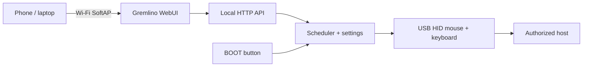

# Gremlino

[](https://github.com/oddyutza/Gremlino/actions/workflows/build.yml)

**Gremlino** is a tiny ESP32-S2 USB HID lab gadget with its own Wi-Fi hotspot and a polished local WebUI.

It started from a very simple idea: keep a workstation awake with a tiny reversible mouse movement. Then the gremlin got Wi-Fi.

> Built for devices you own or are explicitly authorized to test. Gremlino deliberately keeps its HID actions small and reversible: mouse nudges, mouse orbits and a paired Caps Lock blink. It does not type commands, open shells, execute scripts, or modify host files.

## What it does

- **Idle Killer** — tiny mouse movement at a configurable random interval, followed by an exact return to the original position.
- **Gremlin Mode** — sparse, randomized reversible HID mischief with three intensity levels.
- **Manual controls** — Nudge, Orbit and Caps Blink from the WebUI.
- **Local-only control** — the ESP32-S2 creates its own Wi-Fi AP; no cloud and no external JavaScript/CSS.
- **Captive portal** — connect to the AP and most phones/laptops will offer the control page automatically.
- **Panic button** — the board BOOT button immediately disables active modes and releases keyboard state.
- **Persistent sane settings** — Idle Killer settings survive reboot; Gremlin Mode always boots disabled.
- **Status dashboard** — HID readiness, USB state, connected Wi-Fi clients, uptime, last action and next scheduled action.

## Hardware

Initial target:

- ESP32-S2 Mini / LOLIN S2 Mini compatible board
- ESP32-S2FN4R2-class module
- 4 MB flash
- native USB exposed through USB-C

PlatformIO board profile:

```ini
board = lolin_s2_mini
```

The exact clone may differ slightly. Before flashing, verify that it exposes the ESP32-S2 native USB pins through the USB-C connector and that the BOOT button is on GPIO0.

## First boot

1. Flash the firmware.
2. Plug Gremlino into the host through its native USB port.
3. Join the Wi-Fi network named `Gremlino-XXXX`.
4. Default AP password: `gremlino!`
5. Open `http://192.168.4.1/` if the captive portal does not appear automatically.
6. Keep both modes OFF while confirming that HID status is **Ready**.
7. Enable Idle Killer or Gremlin Mode from the dashboard.

Change the default password before using the device outside a private test environment. Override it at build time with `GREMLINO_AP_PASSWORD` or edit `include/gremlino_config.h`.

## Build

The project uses PlatformIO and the Arduino framework.

```bash
pio run
```

Upload:

```bash
pio run -t upload
```

Serial monitor:

```bash
pio device monitor
```

The CI workflow builds every push and pull request against the `lolin_s2_mini` target.

## Architecture



Everything required by the dashboard is embedded in firmware, so the UI keeps working with no Internet connection.

## Modes

### Idle Killer

Designed to be boring:

- random interval between configurable minimum and maximum values;
- movement amplitude from 1 to 8 pixels;
- every movement is followed by its inverse;
- no keyboard activity.

### Gremlin Mode

Designed for controlled testing and harmless pranks on your own lab machines:

- **Mild** — long quiet periods, mostly tiny nudges;
- **Spicy** — shorter gaps and occasional mouse orbits;
- **Chaos** — more frequent activity, still using only the reversible action set;
- optional 15 min / 1 h / 4 h session timeout or until reboot;
- always disabled after reboot.

The automatic action set intentionally excludes arbitrary key injection and command execution.

## Web API

The WebUI uses a tiny form-encoded local API:

| Endpoint | Method | Purpose |
| --- | --- | --- |
| `/api/status` | GET | Current device state |
| `/api/config` | POST | Update intervals, amplitude, intensity and session length |
| `/api/action` | POST | Toggle modes, run a manual action, or STOP ALL |

The interface polls status once per second. No WebSocket dependency is required.

## Project layout

```text
Gremlino/
├── .github/workflows/build.yml
├── include/gremlino_config.h
├── src/main.cpp
├── src/web_ui.h
├── .gitignore
├── platformio.ini
└── README.md
```

## Safety design

A few choices are intentional:

- Gremlin Mode is **never restored after reboot**.
- BOOT/GPIO0 acts as a runtime panic button.
- STOP ALL disables both schedulers and releases keyboard state.
- Mouse patterns are net-zero whenever possible.
- Keyboard use is limited to a paired Caps Lock blink.
- There is no arbitrary text endpoint and no remote shell functionality.

## Roadmap

First hardware pass comes next once the board arrives. Likely follow-ups:

- verify the exact S2 Mini clone and USB enumeration;
- tune HID timings on Windows;
- test captive portal behavior on Android/iOS/Windows;
- optionally add AP credential setup and named profiles;
- add a real UI screenshot to this README after hardware validation.

---

**Gremlino** — tiny board, suspiciously calm desk.
