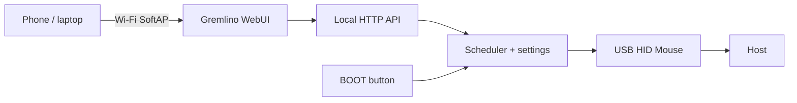

# Gremlino

[](https://github.com/oddyutza/Gremlino/actions/workflows/build.yml)

**Gremlino** is a tiny ESP32-S2 USB HID mouse gadget with its own Wi-Fi hotspot and a polished local WebUI.

It started from a simple idea: keep a workstation awake with tiny reversible mouse movement. Then the gremlin got Wi-Fi.

## Highlights

- **Away Killer** — configurable random mouse nudges followed by an exact return.
- **Gremlin Mode** — randomized, net-zero mouse patterns with three intensity levels.
- **Manual controls** — Nudge and Orbit from the WebUI.
- **Local-only control** — ESP32-S2 SoftAP; no cloud and no external UI dependencies.
- **Captive portal** — connect to the AP and open the dashboard locally.
- **Panic button** — BOOT/GPIO0 immediately stops all activity.
- **Status dashboard** — HID readiness, USB state, Wi-Fi clients, uptime, last action and next action.
- **Persistent settings** — Away Killer settings survive reboot; Gremlin Mode always starts OFF.

## Hardware

Initial target:

- ESP32-S2 Mini / LOLIN S2 Mini compatible board
- 4 MB flash
- native USB through USB-C

PlatformIO board profile:

```ini
board = lolin_s2_mini
```

The exact clone may differ slightly. Verify that the USB-C connector is wired to the ESP32-S2 native USB interface and that BOOT is GPIO0.

## First boot

1. Flash the firmware.
2. Plug Gremlino into the host through its native USB port.
3. Join `Gremlino-XXXX`.
4. Default AP password: `gremlino!`
5. Open `http://192.168.4.1/` if the captive portal does not appear.
6. Confirm HID status is **Ready**.
7. Enable Away Killer or Gremlin Mode.

Change the default password before using it outside a private environment.

## Build

```bash
pio run
pio run -t upload
pio device monitor
```

CI builds the `lolin_s2_mini` target on every push and pull request.

## Architecture



Everything required by the UI is embedded in firmware, so it works without Internet access.

## Modes

### Away Killer

Designed to stay out of the way:

- random interval between configurable minimum and maximum values;
- movement amplitude from 1 to 8 pixels;
- every movement returns to its starting point;
- no clicks and no keyboard events.

### Gremlin Mode

Mouse-only randomized activity:

- **Mild** — long quiet periods and small nudges;
- **Spicy** — shorter gaps and occasional square/orbit patterns;
- **Chaos** — more frequent activity while still using net-zero patterns;
- optional 15 min / 1 h / 4 h timeout or until reboot;
- always disabled after reboot.

## Web API

| Endpoint | Method | Purpose |
| --- | --- | --- |
| `/api/status` | GET | Device state |
| `/api/config` | POST | Intervals, amplitude, intensity and session length |
| `/api/action` | POST | Toggle modes, manual mouse action, STOP ALL |

## Project layout

```text
Gremlino/
├── .github/workflows/build.yml
├── docs/BRINGUP.md
├── include/gremlino_config.h
├── src/main.cpp
├── src/web_ui.h
├── .gitignore
├── platformio.ini
└── README.md
```

## Roadmap

The first real hardware pass starts when the board arrives. The step-by-step checklist lives in [`docs/BRINGUP.md`](docs/BRINGUP.md).


- verify USB enumeration on the exact clone;
- tune HID timings on Windows;
- test captive portal behavior on Android/iOS/Windows;
- add an actual UI screenshot after hardware validation;
- refine presets based on real use.

---

**Gremlino** — tiny board, suspiciously calm desk.
