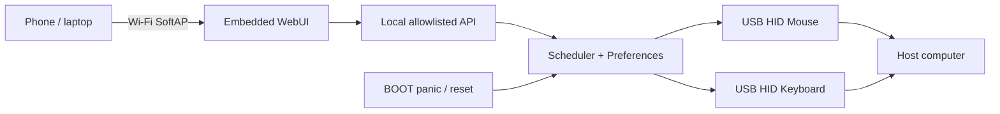

# Gremlino

[](https://github.com/oddyutza/Gremlino/actions/workflows/build.yml)

**Gremlino 1.1** is a tiny ESP32-S2 USB HID mischief appliance with its own Wi-Fi hotspot and a polished local WebUI.

It started as a mouse jiggler. Then the gremlin got Wi-Fi, a dashboard, USB identity profiles and a deliberately annoying — but tightly allowlisted — keyboard prank deck.

> Built for devices you own or are explicitly authorized to test. Gremlino does not type arbitrary text, launch commands, open shells, use modifier shortcuts or expose a generic keyboard-injection endpoint.

## Highlights

- **Away Killer** — tiny reversible mouse nudges at a configurable random interval.
- **Gremlin Mode** — randomized mouse + keyboard annoyances selected from a user-controlled Mischief Deck.
- **Mild / Spicy / Chaos** — progressively shorter gaps and occasional 2–3 action bursts.
- **Mischief Deck** — enable only the pranks you want; each action also has a manual test button.
- **Local WebUI** — responsive, embedded HTML/CSS/JS; no CDN, cloud or Internet dependency.
- **Wi-Fi SoftAP + captive portal** — control Gremlino directly from a phone or laptop.
- **USB identity profiles** — preset-only host-visible manufacturer/product strings.
- **Physical recovery** — tap BOOT for panic stop; hold BOOT for 7 seconds for factory reset.
- **Persistent settings** — Away Killer, deck, timing and device settings survive reboot.
- **Safe boot behavior** — Gremlin Mode always starts OFF after reboot.
- **Live telemetry** — USB/HID state, clients, uptime, next action, session time, IP, heap and USB identity.

## Hardware target

Initial target:

- ESP32-S2 Mini / LOLIN S2 Mini compatible board
- ESP32-S2 native USB
- 4 MB flash
- USB-C connected to the ESP32-S2 native USB interface
- BOOT button on GPIO0

PlatformIO target:

```ini
board = lolin_s2_mini
platform = espressif32@7.1.3
```

The pinned platform currently resolves Arduino-ESP32 2.0.17 for this environment.

## USB interfaces

Gremlino 1.1 enumerates as a composite USB device with:

- USB CDC serial
- HID mouse
- HID keyboard

The keyboard interface exists only for the built-in allowlisted prank actions.

### USB identity profiles

The WebUI can select one of these preset identities:

- **Gremlino** — `Gremlino / Gremlino`
- **USB Receiver** — `Generic / USB Receiver`
- **Office Mouse** — `Generic / Office Mouse`
- **Desktop Input** — `Generic / Desktop Input Device`

The USB serial is stable and derived from the ESP32-S2 chip ID. Identity changes apply after reboot.

VID/PID remain the board-profile defaults; Gremlino does not copy real third-party vendor VID/PID pairs.

## Mischief Deck

Gremlin Mode can randomly choose only from the actions enabled in the WebUI.

### Mouse

- Nudge
- Orbit

### Keyboard

- Space
- Tab
- Page Up
- Page Down
- Home
- End
- Left Arrow
- Right Arrow
- Up Arrow
- Down Arrow
- Caps Lock blink

Caps Lock blink is paired — Caps Lock is toggled and then toggled back after a short delay.

There is intentionally **no** Backspace, Delete, Enter, modifier key, Win/Command shortcut, function-key launcher, arbitrary text field or command endpoint.

### Intensity

| Profile | Timing | Burst behavior |
| --- | --- | --- |
| Mild | 45–120 s | 1 action |
| Spicy | 20–75 s | occasional 2-action burst |
| Chaos | 8–35 s | occasional 2–3 action burst |

Gremlin Mode can run for 15 minutes, 1 hour, 4 hours or until reboot. It is always OFF after boot.

## Flash the board

### PlatformIO — recommended for development

Install PlatformIO:

```bash
python -m pip install "platformio==6.2.0"
```

Clone and enter the repository:

```bash
git clone https://github.com/oddyutza/Gremlino.git
cd Gremlino
```

Connect the ESP32-S2 Mini using a **data-capable** USB-C cable, then:

```bash
pio device list
pio run
pio run -t upload
```

If more than one device is connected:

```bash
# Windows
pio run -t upload --upload-port COM7

# Linux
pio run -t upload --upload-port /dev/ttyACM0
```

### Force the ROM bootloader

If upload does not detect the board:

1. hold **BOOT**;
2. tap **RESET** while BOOT is held — or reconnect USB while holding BOOT if the clone has no RESET button;
3. release **BOOT**;
4. run `pio run -t upload` again.

### Flash the GitHub artifact with esptool

GitHub Actions publishes a `gremlino-firmware` artifact containing:

- `bootloader.bin`
- `partitions.bin`
- `boot_app0.bin`
- `firmware.bin`
- `firmware.elf`
- `FLASH_WITH_ESPTOOL.txt`

Install esptool:

```bash
python -m pip install esptool
```

Windows example:

```bash
esptool --chip esp32s2 --port COM7 --baud 921600 write-flash \
  --flash-mode dio --flash-freq 80m --flash-size 4MB \
  0x1000 bootloader.bin \
  0x8000 partitions.bin \
  0xe000 boot_app0.bin \
  0x10000 firmware.bin
```

Linux example:

```bash
esptool --chip esp32s2 --port /dev/ttyACM0 --baud 921600 write-flash \
  --flash-mode dio --flash-freq 80m --flash-size 4MB \
  0x1000 bootloader.bin \
  0x8000 partitions.bin \
  0xe000 boot_app0.bin \
  0x10000 firmware.bin
```

Older esptool 4.x installations may use `write_flash` instead of `write-flash`.

## First boot

1. Flash Gremlino.
2. Reconnect/reset the board normally.
3. Join `Gremlino-XXXX`.
4. Default AP password: `gremlino!`
5. Open `http://192.168.4.1/` if the captive portal does not appear.
6. Confirm **USB: Active** and **HID: Mouse + Keyboard**.
7. Test a Nudge and one keyboard tile manually.
8. Change the default Wi-Fi password.

Serial monitor:

```bash
pio device monitor
```

Startup output includes firmware version, AP/IP and active USB identity.

## Physical button

BOOT / GPIO0:

- **tap** — STOP ALL immediately and release keyboard state;
- **hold 7 seconds** — factory reset and reboot.

Factory reset clears Wi-Fi, USB identity, deck and mode/timing settings.

## Architecture



## Local API

| Endpoint | Method | Purpose |
| --- | --- | --- |
| `/api/status` | GET | Runtime/device/deck status |
| `/api/config` | POST | Timing, intensity, session and prank-mask settings |
| `/api/network` | POST | AP SSID/password |
| `/api/usb` | POST | Select USB identity preset |
| `/api/action` | POST | Allowlisted manual actions, mode toggles and STOP ALL |
| `/api/system` | POST | Reboot or factory reset |

The action API does not accept arbitrary keycodes or text.

## Build

Requirements:

- Python 3.9+
- PlatformIO Core 6.2.0

```bash
python -m pip install "platformio==6.2.0"
pio run
```

CI is pinned to Ubuntu 24.04, Python 3.13, PlatformIO 6.2.0 and `espressif32@7.1.3`, and publishes the standalone flash bundle after every successful build on `main`.

## Project layout

```text
Gremlino/
├── .github/workflows/build.yml
├── docs/BRINGUP.md
├── include/gremlino_config.h
├── src/main.cpp
├── src/web_ui.h
├── CHANGELOG.md
├── platformio.ini
└── README.md
```

## Hardware validation

Software builds are covered by CI. USB enumeration, the exact clone's BOOT wiring, HID behavior and captive-portal behavior still require the physical board.

Use [`docs/BRINGUP.md`](docs/BRINGUP.md) for the first-board acceptance pass.

---

**Gremlino** — tiny board, suspiciously calm desk.
