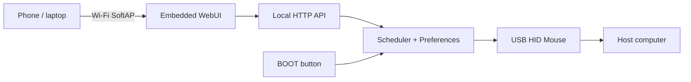

# Gremlino

[](https://github.com/oddyutza/Gremlino/actions/workflows/build.yml)

**Gremlino 1.0** is a tiny ESP32-S2 USB HID mouse gadget with its own Wi-Fi hotspot and a polished local WebUI.

It started from a simple idea: keep a workstation awake with tiny reversible mouse movement. Then the gremlin got Wi-Fi.

> Software is complete and CI-built for the `lolin_s2_mini` target. Final hardware validation is intentionally tracked separately because the exact ESP32-S2 Mini clone is still in transit.

## Features

- **Away Killer** — random, configurable mouse nudges followed by an exact return.
- **Gremlin Mode** — mouse-only randomized activity with Mild, Spicy and Chaos presets.
- **Manual actions** — Nudge and Orbit from the dashboard.
- **Local WebUI** — fully embedded HTML/CSS/JS; no CDN, cloud or Internet dependency.
- **Wi-Fi SoftAP + captive portal** — connect directly to Gremlino from phone or laptop.
- **Device settings** — change AP name/password from the WebUI.
- **System controls** — reboot and factory reset from the WebUI.
- **Physical recovery** — tap BOOT for panic stop; hold BOOT for 7 seconds for factory reset.
- **Persistent configuration** — Away Killer and timing/network settings survive reboot.
- **Safe reboot behavior** — Gremlin Mode always starts OFF after reboot.
- **Live telemetry** — HID state, USB state, clients, uptime, next action, session time, IP and free heap.

## Hardware target

Initial target:

- ESP32-S2 Mini / LOLIN S2 Mini compatible board
- ESP32-S2 with native USB
- 4 MB flash
- USB-C connected to the ESP32-S2 native USB interface
- BOOT button on GPIO0

PlatformIO target:

```ini
board = lolin_s2_mini
platform = espressif32@7.1.3
```

The current PlatformIO platform resolves Arduino-ESP32 2.0.17 for this environment.

## First boot

1. Build and flash Gremlino.
2. Connect the board to the host using its native USB port.
3. Join the Wi-Fi network `Gremlino-XXXX`.
4. Default AP password: `gremlino!`
5. Open `http://192.168.4.1/` if the captive portal does not appear automatically.
6. Confirm **USB: Active** and **HID: Ready**.
7. Use **Test nudge** before enabling an automatic mode.
8. Change the default Wi-Fi password in **Device → Wi-Fi access point**.

## Build

Requirements:

- Python 3.9+
- PlatformIO Core 6.2.0

```bash
python -m pip install "platformio==6.2.0"
pio run
pio run -t upload
pio device monitor
```

CI is pinned to Ubuntu 24.04, Python 3.13, PlatformIO 6.2.0 and `espressif32@7.1.3`.

## Modes

### Away Killer

Designed to be boring:

- configurable 5–300 second minimum/maximum interval;
- configurable 1–8 pixel amplitude;
- each movement is followed by its inverse;
- no clicks;
- no keyboard events.

### Gremlin Mode

Mouse-only randomized activity:

- **Mild** — long quiet periods and small nudges;
- **Spicy** — shorter gaps and occasional orbit patterns;
- **Chaos** — more frequent activity while retaining net-zero movement patterns;
- 15 min / 1 h / 4 h session timeout, or until reboot;
- always OFF after reboot.

## Physical button

BOOT / GPIO0 has two runtime functions:

- **tap** — STOP ALL immediately;
- **hold 7 seconds** — factory reset and reboot.

Factory reset clears saved Wi-Fi, mode and timing settings.

## Architecture



## Local API

| Endpoint | Method | Purpose |
| --- | --- | --- |
| `/api/status` | GET | Runtime/device status |
| `/api/config` | POST | Away Killer and Gremlin settings |
| `/api/network` | POST | AP SSID/password |
| `/api/action` | POST | Mode toggles, manual actions, STOP ALL |
| `/api/system` | POST | Reboot or factory reset |

The API is intentionally local to the Gremlino access point.

## Project layout

```text
Gremlino/
├── .github/workflows/build.yml
├── docs/BRINGUP.md
├── include/gremlino_config.h
├── src/main.cpp
├── src/web_ui.h
├── CHANGELOG.md
├── platformio.ini
└── README.md
```

## Hardware validation

The firmware build can be validated in CI, but USB enumeration, the exact clone's BOOT wiring and captive-portal behavior require the physical board.

Use [docs/BRINGUP.md](docs/BRINGUP.md) for the hardware acceptance pass. Anything discovered there should be treated as a board-specific correction to 1.0, not missing core functionality.

---

**Gremlino** — tiny board, suspiciously calm desk.
